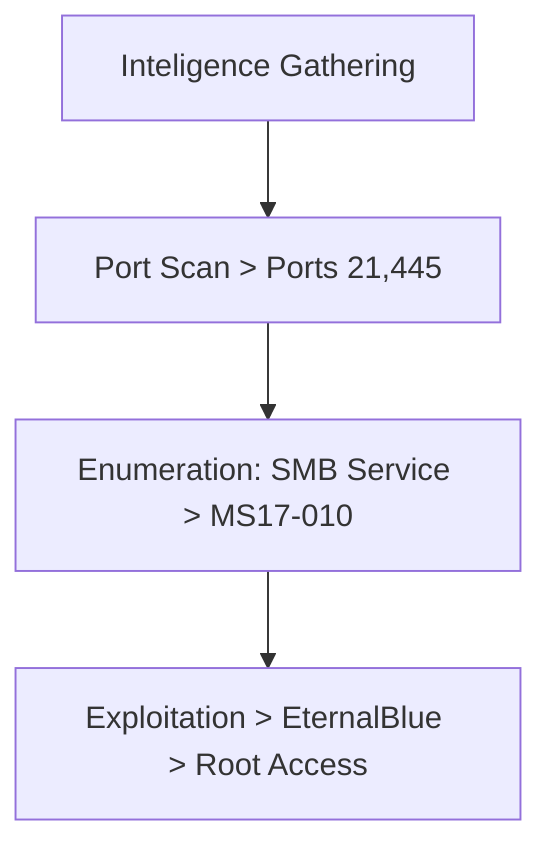
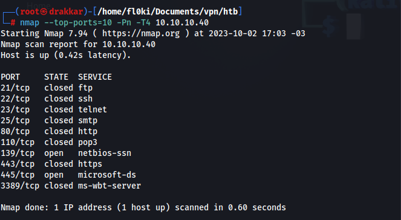

---

title: "Blue"
categories: [CTF, Hack The Box]
tags: [EASY, Windows, SMB, MS17-010, EternalBlue]
mermaid: true
image: ../assets/img/htb/blue/blue.png

---

The exploration of  box "Blue" involved several critical steps. It started with scanning for open ports using the nmap tool, identifying key services like FTP and SMB. Although FTP access was refused, the SMB service was found vulnerable to the MS17-010 exploit, commonly known as EternalBlue. Exploitation was carried out using Metasploit, specifically the exploit/windows/smb/ms17_010_eternalblue module. After setting the necessary parameters, a successful shell was obtained with privileged access, leading to root access. This process included network vulnerability exploitation and privilege escalation, culminating in full system control.

# Overview



## 1. Intelligence Gathering

### Port Scan

```bash
nmap --top-ports=10 -Pn -T4 10.10.10.40
```



Service versions


## 2. Enumeration

### Port 21


connection refused

### Port 445


Script for the vulnerability (nmap)

```bash
nmap -p 139,443,445 10.10.10.40 --script smb-vuln-ms17-010
```


Search for an exploit for vulnerability CVE-2017-0143


## 3. Exploitation

Open the Metasploit framework and search for `ms17-010`


Use the exploit `exploit/windows/smb/ms17_010_eternalblue`


Set the information for the exploit.


I already have the shell with privileged access

Root Access

