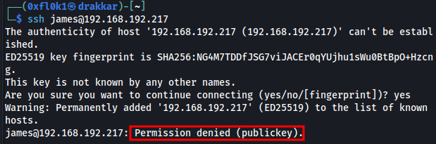

---

title: "Blogger"
categories: [CTF, Proving Grounds - Play]
tags: [EASY, Linux, Web, Wordpress, Insecure File Upload, Sudo Misconfiguration]
mermaid: true
image: ../assets/img/pg/offsec.jpeg

---

The exploitation of the "Blogger" box involved several critical steps. First, intelligence gathering was conducted through a port scan using the nmap tool, identifying open ports such as 22 and 80. Enumeration revealed a website running on Apache, which redirected to a Blogger domain. Using WPScan, users and vulnerable plugins were identified, including outdated versions of Akismet and wpDiscuz. Exploitation was carried out through an insecure file upload vulnerability, allowing for remote code execution. During post-exploitation, lateral movement to the vagrant user was achieved using the password "vagrant," and privilege escalation to root was completed using sudo misconfiguration. The process included web vulnerability exploitation, file uploads, and privilege escalation, leading to full system access.

# Overview


## 1. Information Gathering

### Port Scan

```bash
sudo nmap -sC -sV -p- 192.168.192.217 -T5 -v 
```

Output

```
PORT   STATE SERVICE VERSION
22/tcp open  ssh     OpenSSH 7.2p2 Ubuntu 4ubuntu2.10 (Ubuntu Linux; protocol 2.0)
| ssh-hostkey: 
|   2048 95:1d:82:8f:5e:de:9a:00:a8:07:39:bd:ac:ad:d3:44 (RSA)
|   256 d7:b4:52:a2:c8:fa:b7:0e:d1:a8:d0:70:cd:6b:36:90 (ECDSA)
|_  256 df:f2:4f:77:33:44:d5:93:d7:79:17:45:5a:a1:36:8b (ED25519)
80/tcp open  http    Apache httpd 2.4.18 ((Ubuntu))
| http-methods: 
|_  Supported Methods: GET HEAD POST OPTIONS
|_http-server-header: Apache/2.4.18 (Ubuntu)
|_http-title: Blogger | Home
Service Info: OS: Linux; CPE: cpe:/o:linux:linux_kernel

```

## 2. Enumeration

### Port 22



Not authenticated with username and password

### Port 80


Fuzzing of directories and files

```bash
feroxbuster -u http://192.168.192.217 -k -C 404,403,500  --wordlist=/usr/share/wordlists/dirb/big.txt -x php,asp,txt,xml,bak
```

```
[####################] - 6m    122814/122814  362/s   http://192.168.192.217/ 
[####################] - 2s    122814/122814  77730/s http://192.168.192.217/css/ => Directory listing
[####################] - 1s    122814/122814  103466/s http://192.168.192.217/js/ => Directory listing
[####################] - 5s    122814/122814  25666/s http://192.168.192.217/images/ => Directory listing
[####################] - 0s    122814/122814  449868/s http://192.168.192.217/assets/ => Directory listing
[####################] - 2s    122814/122814  54779/s http://192.168.192.217/assets/css/ => Directory listing
[####################] - 3s    122814/122814  39200/s http://192.168.192.217/assets/fonts/ => Directory listing
[####################] - 3s    122814/122814  38476/s http://192.168.192.217/assets/images/ => Directory listing
[####################] - 1s    122814/122814  115210/s http://192.168.192.217/assets/js/ => Directory listing
[####################] - 6m    122814/122814  360/s   http://192.168.192.217/assets/fonts/blog/ 
```

[http://192.168.192.217/assets/fonts/blog/](http://192.168.192.217/assets/fonts/blog/)


Redirect to Blogger domain

So, add Blogger in `/etc/hosts`.

While enumerating the website, found [http://blogger.pg/assets/fonts/blog/wp-login.php](http://blogger.pg/assets/fonts/blog/wp-login.php) - 'WordPress CMS identified'.


WPSCAN wanting to discover users and vulnerable plugins

```bash
wpscan --url http://blogger.pg/assets/fonts/blog/ --enumerate p --plugins-detection aggressive
```

```
[i] User(s) Identified:

[+] jm3s
 | Found By: Author Id Brute Forcing - Author Pattern (Aggressive Detection)
 
-----------------------------------------------------------------------------------------
 
[i] Plugin(s) Identified:

[+] akismet
 | Location: http://blogger.pg/assets/fonts/blog/wp-content/plugins/akismet/
 | Last Updated: 2024-05-31T16:57:00.000Z
 | Readme: http://blogger.pg/assets/fonts/blog/wp-content/plugins/akismet/readme.txt
 | [!] The version is out of date, the latest version is 5.3.2
 |
 | Found By: Known Locations (Aggressive Detection)
 |  - http://blogger.pg/assets/fonts/blog/wp-content/plugins/akismet/, status: 200
 |
 | Version: 4.0.8 (100% confidence)
 | Found By: Readme - Stable Tag (Aggressive Detection)
 |  - http://blogger.pg/assets/fonts/blog/wp-content/plugins/akismet/readme.txt
 | Confirmed By: Readme - ChangeLog Section (Aggressive Detection)
 |  - http://blogger.pg/assets/fonts/blog/wp-content/plugins/akismet/readme.txt

[+] wpdiscuz
 | Location: http://blogger.pg/assets/fonts/blog/wp-content/plugins/wpdiscuz/
 | Last Updated: 2024-06-23T08:38:00.000Z
 | Readme: http://blogger.pg/assets/fonts/blog/wp-content/plugins/wpdiscuz/readme.txt
 | [!] The version is out of date, the latest version is 7.6.20
 |
 | Found By: Known Locations (Aggressive Detection)
 |  - http://blogger.pg/assets/fonts/blog/wp-content/plugins/wpdiscuz/, status: 200
 |
 | Version: 7.0.4 (80% confidence)
 | Found By: Readme - Stable Tag (Aggressive Detection)
 |  - http://blogger.pg/assets/fonts/blog/wp-content/plugins/wpdiscuz/readme.txt

```

[http://blogger.thm/assets/fonts/blog/](http://blogger.thm/assets/fonts/blog/)


The first article redirects to [http://blogger.thm/assets/fonts/blog/?p=29](http://blogger.thm/assets/fonts/blog/?p=29), where the vulnerability 'file upload insecure' was found.

## 3. Exploitation

### Insecure File Upload

[http://blogger.thm/assets/fonts/blog/?p=29](http://blogger.thm/assets/fonts/blog/?p=29)

Modify the file's signature because the application didn't accept it.


Modified to GIF format


Allowed


Click the shell code and listen on port 1234 using the nc tool


Initial Access


## 4. Post-Exploitation

Lateral pivot to Vagrant with password 'vagrant,' then use `sudo -l` (Sudo Misconfiguration) to gain root access.

Root Acess

