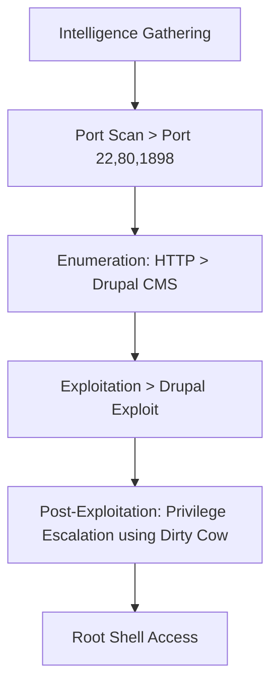
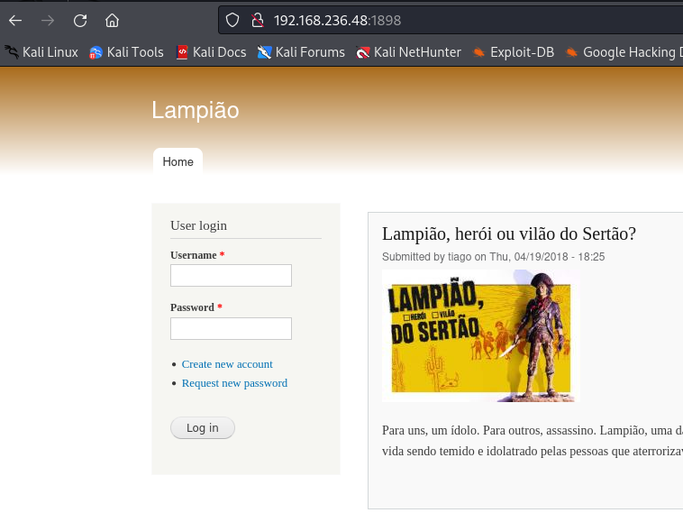

The exploitation of the “Lampião” box involved several critical steps. First, information gathering was conducted through a port scan using the nmap tool, identifying open ports such as 22, 80, and 1898. The enumeration revealed a Drupal CMS running on port 1898, specifically version 7.54. Using droopescan, several plugins and themes were identified, along with potential vulnerabilities. Initial access was gained by exploiting the Drupal CMS using Metasploit. During post-exploitation, a sensitive file was discovered, providing SSH access with the password “Virgulino”. Privilege escalation was achieved by exploiting the Linux kernel vulnerability with the Dirt Cow exploit, allowing root access. The process included techniques for exploiting web service vulnerabilities, remote command execution, and privilege escalation, culminating in full system access and retrieval of evidence files.

# Overview



## 1. Information Gathering

### Port Scan
```bash
nmap -Pn -sV -sC -p- --open 192.168.236.48 -v
```
Output
```
PORT     STATE SERVICE VERSION
22/tcp   open  ssh     OpenSSH 6.6.1p1 Ubuntu 2ubuntu2.13 (Ubuntu Linux; protocol 2.0)
| ssh-hostkey: 
|   1024 46:b1:99:60:7d:81:69:3c:ae:1f:c7:ff:c3:66:e3:10 (DSA)
|   2048 f3:e8:88:f2:2d:d0:b2:54:0b:9c:ad:61:33:59:55:93 (RSA)
|   256 ce:63:2a:f7:53:6e:46:e2:ae:81:e3:ff:b7:16:f4:52 (ECDSA)
|_  256 c6:55:ca:07:37:65:e3:06:c1:d6:5b:77:dc:23:df:cc (ED25519)
80/tcp   open  http?
| fingerprint-strings: 
|   HTTPOptions: 
|     _____ _ _ 
|     |_|/ ___ ___ __ _ ___ _ _ 
|     \x20| __/ (_| __ \x20|_| |_ 
|     ___/ __| |___/ ___|__,_|___/__, ( ) 
|     |___/ 
|     ______ _ _ _ 
|     ___(_) | | | |
|     \x20/ _` | / _ / _` | | | |/ _` | |
|_    __,_|__,_|_| |_|
1898/tcp open  http    Apache httpd 2.4.7 ((Ubuntu))
| http-methods: 
|_  Supported Methods: GET HEAD POST OPTIONS
|_http-generator: Drupal 7 (http://drupal.org)
|_http-server-header: Apache/2.4.7 (Ubuntu)
|_http-title: Lampi\xC3\xA3o
| http-robots.txt: 36 disallowed entries (15 shown)
| /includes/ /misc/ /modules/ /profiles/ /scripts/ 
| /themes/ /CHANGELOG.txt /cron.php /INSTALL.mysql.txt 
| /INSTALL.pgsql.txt /INSTALL.sqlite.txt /install.php /INSTALL.txt 
|_/LICENSE.txt /MAINTAINERS.txt
|_http-favicon: Unknown favicon MD5: CF2445DCB53A031C02F9B57E2199BC03

```

## 2. Enumeration

### Port 1898

It is running a Drupal CMS.



droopscan tool

```bash
droopescan scan drupal -u [http://192.168.236.48:1898](http://192.168.236.48:1898/)
```

```
[+] Plugins found:                                                              
    profile http://192.168.236.48:1898/modules/profile/
    php http://192.168.236.48:1898/modules/php/
    image http://192.168.236.48:1898/modules/image/

[+] Themes found:
    seven http://192.168.236.48:1898/themes/seven/
    garland http://192.168.236.48:1898/themes/garland/

[+] Possible version(s):
    7.54

[+] Possible interesting urls found:
    Default changelog file - http://192.168.236.48:1898/CHANGELOG.txt

[+] Scan finished (0:02:54.053721 elapsed)
```

Version: 7.54

search for exploit in Metasploit


## 3. Exploitation

Initial Access


## 4. Post-Exploitation

For privilege escalation, the file “/var/www/html/sites/default/settings.php” was found.


access to SSH protocol with password "Virgulino"


vulnerable kernel

```bash
uname -a
```


Exploit Dirty Cow:

[Linux Kernel 2.6.22 < 3.9 - 'Dirty COW /proc/self/mem' Race Condition Privilege Escalation (/etc/passwd Method)](https://www.exploit-db.com/exploits/40847)


new password for root: "dirtyConFun"


Root Access

